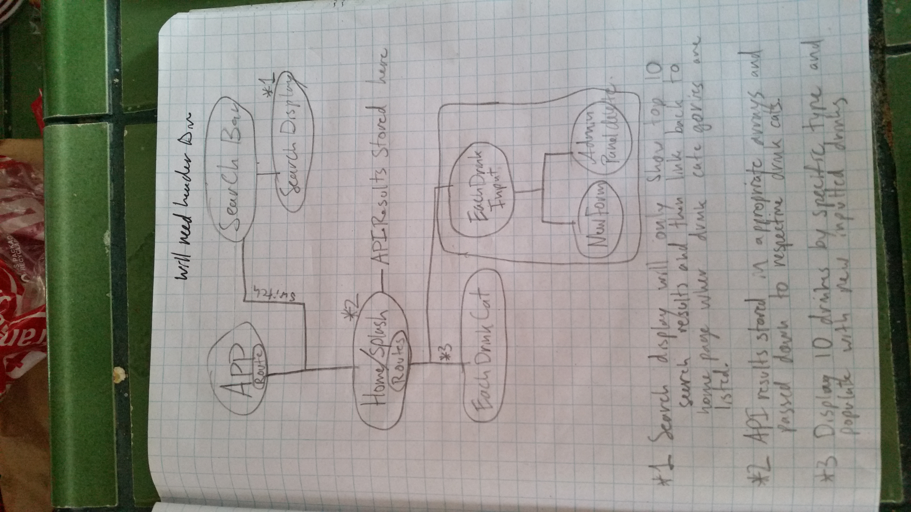
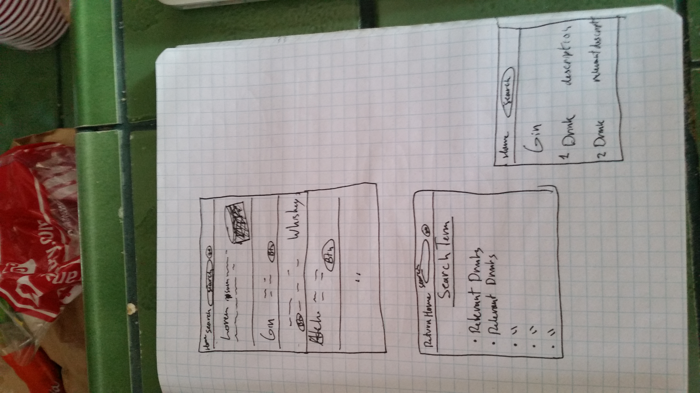

# Week 3 Friday Project

## Description

This was an unorthodox Friday project as we were given the option to study or work on the initial phases of our Capstone project. I chose to split my time between the two activities. In the morning I developed the component structure of my site with pen and paper, as well as brainstormed ideas for how features would be implemented, the stylings, and researching some of the more unfamiliar processes involved. Photos will be included to map my thought process. I particularly looked at API calls within react. I struggled with API calls before, and want to be sure I have a solid understanding of how the data should be flowing in and out of api calls within React. Just before lunch I actually created this atom project and started building out basic components for the site, very bare bones stuff though. This was mostly just so I could have a repository to commit and come back to next week. After lunch I studied Wordpress site development and an associated program called DiviBuilder. Many of the upcoming internships specify they work with Wordpress, and I had never worked with Wordpress ever before. I was also recently approached by an old friend about doing some work for him at his small media company. The project he mentioned also was a wordpress endeavor using DiviBuilder, and between the offer and the internships I thought looking over Wordpress would be a good studying opportunity.

d
#### By Drew Yoxsimer

## HOURLY BREAKDOWN WEEK 1

* **8:30 - 9:30**  Looked over basics of API calls within React.
* **9:30 - 11:30**  Sketched out multiple versions of component structure as well as display formats with pen and paper.
* **11:30 - 12:00**   Made new file using a cloned react template and inputted component names.
* **12:00 - 1:15**   Lunch
* **1:15 - 1:20**   Git inited over previous file.
* **1:20 - 3:45**  Watched DiviBuilder and Wordpress youtube tutorials.
* **3:45 - 4:15**   Filled in bare bones of components as a sort of mental break from the videos.
* **4:15 - 5:00** Authored README

## HOURLY BREAKDOWN WEEK 2

* **8:15 - 8:45** Re-drawing component structure to better show state and form usage.
* **8:45 - 9:30** Created rest of the basic components.
* **9:30 - 11:00** Weeded out syntax errors and reviewed Redux instructional youtube video linked below.
* **11:00 - 12:00** Started including classNames to conect my mental map with in code examples.
* **12:00 - 1:00** Lunch
* **1:00 - 2:45** Worked with figma for the first time to create design for homepage.
* **2:45 - 4:00** Wrote and created drinks component with prototype for Prop Types included based on sketches. Also created and skeleton-ed a form component for creating drink entries .
* **4:00 - 4:30** Updated README
## IMAGES

Component Tree

Sketches of display first draft

Display first draft continued

Display built out using figma, first draft of more robust designs.

## STUDYING MATERIALS

https://www.youtube.com/watch?v=2cbvZf1jIJM : Introduction to Wordpress Tutorial
https://www.youtube.com/watch?v=UvX3_vlFf5w : Video Explaining Divi Theme

https://www.youtube.com/watch?v=3sjMRS1gJys : Redux Explination video

## MVP FOR CAPSTONE

Goals | Finished?
----------|----------|
Include search feature for drink by name | Not Yet
Include top 10 drink example API calls | Not Yet
Ability to add and edit posts of your own drink recipe | Not Yet
Ability to delete posts as an admin | Not Yet
Ability to save and share inputted posts publically | Not Yet
Clean and intuitive design | Not Yet
Animations based on drink proportions found in recipe | Not Yet

## STRETCH GOALS

Goals | Finished?
----------|----------|
Create dynamically created models of each drink based on recipe input | Not Yet
Ability to look up drinks by single ingredient | Not Yet

## Technologies Used

* React

## Support and contact details

If there are any _questions_ or would like to contribute to the code, please feel free to email:

_[Drew Yoxsimer](mailto:drewyox@gmail.com)_

## License

This software is licensed under the MIT license.

Copyright (c) 2019 **Drew Yoxsimer**
